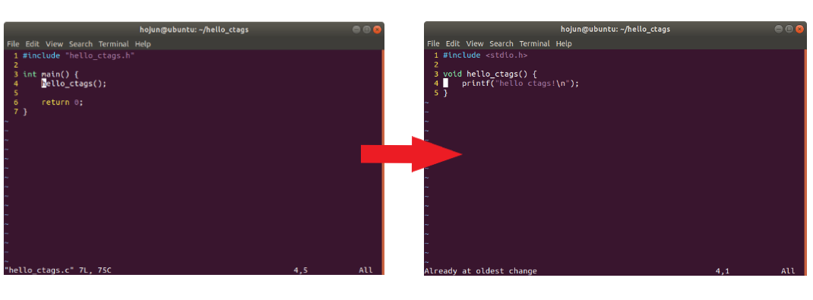

# Ctags 

## 설치 및 설정법
이 글에서는 ctags라는 tool에 대해서 배웁니다.  
ctags는 Linux에서 vim을 이용하여 코드를 작성할 때 원하는 함수의 정의를 찾기 쉽도록 해줍니다.  
  
먼저 ctags를 설치합니다.

```bash
$ sudo apt install ctags
```
  

그 뒤 원하는 디렉토리로 가서 `tags` 파일을 만듭니다.  
`tags`파일은 코드의 여러 symbol(function, variable, etc..)을 미리 찾아서 저장해놓은 파일입니다.  
vim은 `tags`파일을 이용해서 원하는 symbol을 쉽게 찾을 수 있습니다.  
```bash
$ cd ~/git/linux
$ ctags -R
```
여기까지 입력하셨다면 linux 디렉토리에 `tags`라는 파일이 생겼을겁니다.  
  
  
이제 ctags를 vim에서 사용하기 위해 vim 설정파일인 `.vimrc`에 다음과 같은 코드를 추가합니다.  
  
vimrc파일을 열고  
```bash
$ vim ~/.vimrc
```
  
아래 코드 추가
```vimrc
set tags=./tags;,tags;
```
코드를 추가하면 vim으로 텍스트 파일을 열면 현재 디렉토리 또는 상위디렉토리 중 가장 가까운 `tags` 파일을 열어서 symbol을 검색합니다.

## 사용법
ctags를 사용하면서 가장 많이 사용하는 명령어 두 가지 입니다.  
사실 이 두 명령어만 알아도 ctags 사용에 큰 불편함이 없습니다.
- `:tj` 또는 `Ctrl + ]`  
    vim에서 정의를 찾고 싶은 함수 위에 커서를 둔 뒤 `:tj`를 입력하거나 `Ctrl + ]`를 누르면 해당 함수의 정의를 보여줍니다.  
    
- `:po` 도는 `Ctrl + t`  
    `:po`를 입력하거나 `Ctrl + t`를 누르면 원래코드로 돌아갑니다.  
    위 사진의 반대과정이 일어난다고 보면 됩니다.  
  
아래는 그 이외의 다른 명령어에 대한 설명입니다.  
  
|명령어|설명|
|-----|----|
|:ta 또는 :ts 또는 :tj 또는 Ctrl + ]|Tag가 정의된 위치를 나열하고 선택한 위치로 점프, 현재위치는 stack에 push됨|
|:po 또는 Ctrl + t|Stack을 pop하고 그 위치로 점프|
|:sts 또는 :stj|Tag가 정의된 위치 나열 후 선택한 위치로 창 수평분할해 새로 생성된 창에 표시|
|:tn, :tp, :tr, :tl|tj나 ts로 점프했을 때 (다음, 이전, 처음, 마지막) tag로 점프|
|:pts|Tag가 정의된 위치 나열 후 선택한 위치로 창 수평분할해 새로 생성된 창에 표시하지만 현재 위치에 표시|
|:ptj|미리보기 윈도우에 tag가 정의된 형식 보여줌|
|:ptn, :ptp, :ptr, :ptl|ptj나 pts로 점프했을 때 (다음, 이전, 처음, 마지막) tag로 점프|

Reference(https://bowbowbow.tistory.com/15)
